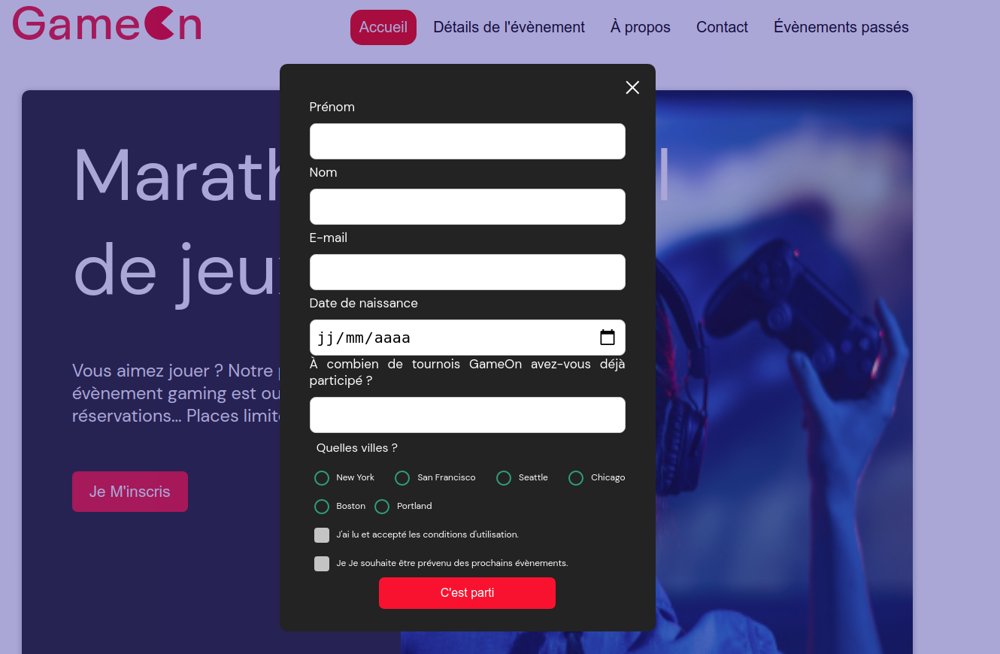

# GAME ON

## Presentation of the context

GameOn is an SME, GameOn, specialized in conferences and game competitions.

## What this project allowed me to practice

### Skills

* JavaScript:
  * manipulate the DOM,
  * listen to events,
  * collect and control user data.

### Technologies / methods

* HTML
* CSS
* JavaScript

## Expected deliverables

* The form should be valid when the user clicks on "Submit"

* The data had to be entered correctly:

  * The First Name field has a minimum of 2 characters / is not empty,
  * the last name field has a minimum of 2 characters / is not empty,
  * email address is valid,
  * for the number of competitions, a numerical value is entered,
  * a radio button is selected,
  * the terms and conditions box is checked, the other box is optional / can be left unchecked,
  * keep form data (don't clear form) when it doesn't pass validation.

I also had to:

* add validation/error messages,

* add a confirmation message when sending successfully.
